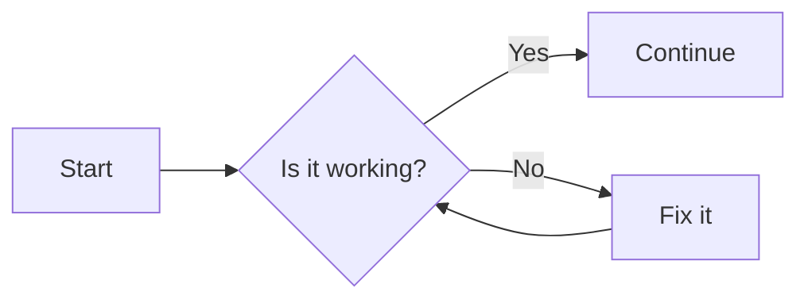
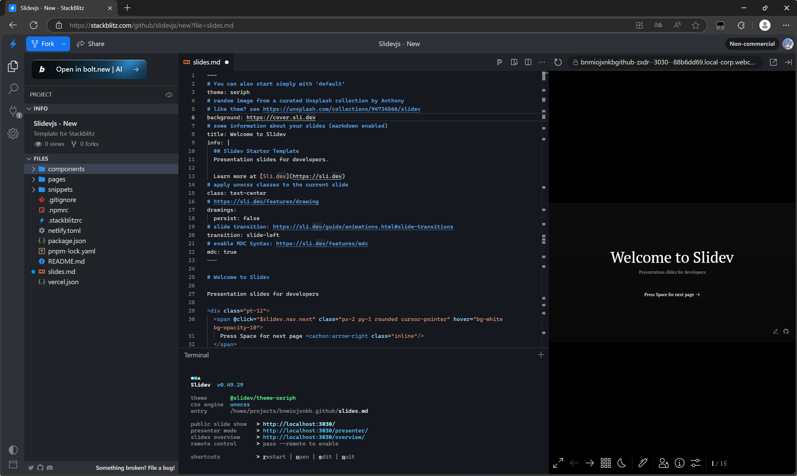
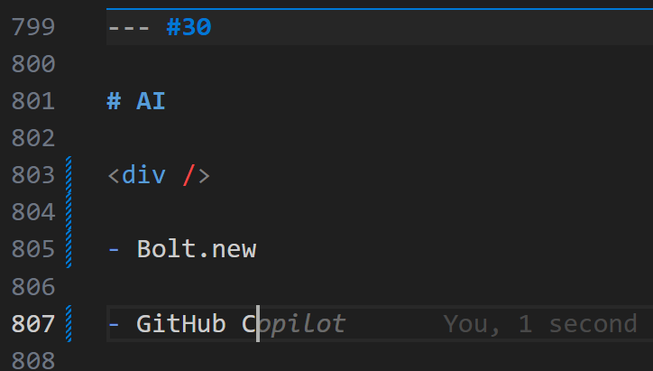
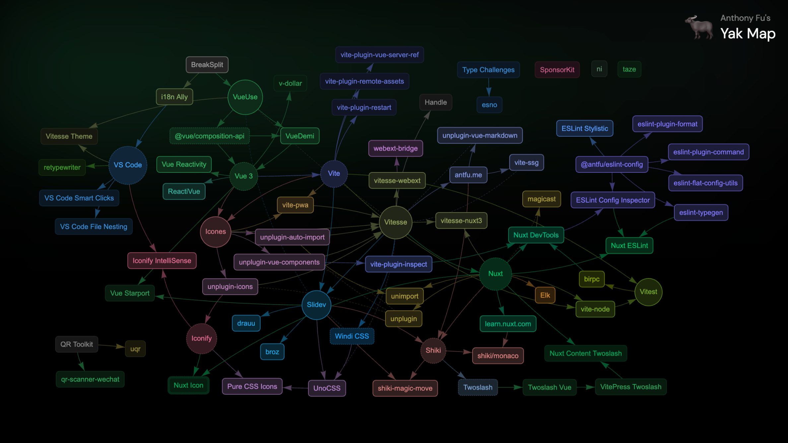

# Welcome to Slidev

Presentation slides for developers

<div abs-br m-6 text-xl>
  <a href="https://github.com/slidevjs/slidev" target="_blank" class="slidev-icon-btn !border-none">
    <carbon:logo-github />
  </a>
</div>

<!-- to preload the modules -->
<Demo hidden />


---
transition: fade-out
layout: intro
class: mx-10
---

# \_Kerman {.font-mono.text-primary}

<div class="leading-8 opacity-80">
Slidev 团队成员 <br>
USTC 本科 2023级
</div>

<div my-16 w-min grid="~ cols-[40px_1fr] gap-y4" items-center justify-center ml--3>
  <div i-ri-github-line op50 ma text-xl/>
  <div><a href="https://github.com/KermanX" target="_blank">github.com/KermanX</a></div>
  <div i-ri-twitter-x-line op50 ma text-xl/>
  <div><a href="https://x.com/KermanX_" target="_blank">x.com/KermanX_</a></div>
  <div i-ri-bluesky-line op50 ma text-xl/>
  <div><a href="https://bsky.app/profile/kermanx.github.io" target="_blank">bsky.app/profile/KermanX.github.io</a></div>
</div>


<div flex="~ gap2">

</div>

---
transition: fade-out
layout: section
---

<div text-5xl pb-2>

Yet Another 

</div>

# Slides Maker?

---
layout: none
zoom: 0.8
preload: false
---

<Demo />

---

# Math?

<div />

$$
\begin{aligned}
\nabla \cdot \vec{E} &= \frac{\rho}{\varepsilon_0} \\
\nabla \cdot \vec{B} &= 0 \\
\nabla \times \vec{E} &= -\frac{\partial\vec{B}}{\partial t} \\
\nabla \times \vec{B} &= \mu_0\vec{J} + \mu_0\varepsilon_0\frac{\partial\vec{E}}{\partial t}
\end{aligned}
$$

---

# Graph?

<div />



---
clicks: 3
---

# Code? <span v-click="2"> Even editable! </span>

<div v-show="$clicks < 2">

````md magic-move
```cpp
#include <stdio.h>

int main() {
  printf("Hello, Slidev!\n");

  for (int i = 0; i < 10; i++) {
    printf("%d\n", i);
  }
}
```

```cpp
#include <iostream>

int main() {
  std::cout << "Hello, Slidev!" << std::endl;

  for (int i : std::views::iota(0, 10)) {
    std::cout << i << std::endl;
  }
}
```
````

</div>

<div v-show="$clicks >= 2">

```cpp {monaco}
#include <iostream>

int main() {
  std::cout << "Hello, Slidev!" << std::endl;

  for (int i : std::views::iota(0, 10)) {
    std::cout << i << std::endl;
  }
}
```

</div>

---

# Interactivity?

<Connections class="mt-4"/>

<!-- <iframe v-click fixed right-0 w-120 h-68 top-30  src="https://sli.dev" ></iframe> -->

<iframe v-click fixed right-10 w-120 h-68 top-30 bottom-0  src="https://www.youtube.com/embed/dQw4w9WgXcQ?si=hCnWGH-S8ML-hjau" title="YouTube video player" frameborder="0" allow="accelerometer; autoplay; clipboard-write; encrypted-media; gyroscope; picture-in-picture; web-share" referrerpolicy="strict-origin-when-cross-origin" allowfullscreen></iframe>

---

# Animation?

<div class="w-60 relative">
  <div class="relative w-40 h-40">
    
    
    
  </div>

  <div
    class="text-5xl absolute top-14 left-40 text-[#2B90B6] -z-1"
    v-motion
    :initial="{ x: -80, opacity: 0}"
    :enter="{ x: 0, opacity: 1, transition: { delay: 2000, duration: 1000 } }">
    Slidev
  </div>
</div>

<!-- vue script setup scripts can be directly used in markdown, and will only affects current page -->
<script setup lang="ts">
const final = {
  x: 0,
  y: 0,
  rotate: 0,
  scale: 1,
  transition: {
    type: 'spring',
    damping: 10,
    stiffness: 20,
    mass: 2
  }
}
</script>

---

# Open Source & Free!

<div />

#### 假设：

- 学生 (USTC)
- 没有/几乎没有 JavaScript / HTML / CSS 经验

<div h-2 />

#### 目标：

- 对于学术幻灯片，提高制作效率：
    - 学术幻灯片只需要排版和代码展示，基于文本的方式最为高效
    - 专注于文本内容，自带优雅的样式
- 使你的幻灯片更吸引人
    - 制作可交互的幻灯片
    - Slidev is Hackable


---
layout: section
---

<h1>
<span class="text-white!"> Your First </span>
<span class="slidev"> Slidev </span>
</h1>

<style>
.slidev {
  background-color: #2B90B6;
  background-image: linear-gradient(45deg, #4EC5D4 10%, #146b8c 80%);
  background-size: 100%;
  -webkit-background-clip: text;
  -moz-background-clip: text;
  -webkit-text-fill-color: transparent;
  -moz-text-fill-color: transparent;
}
</style>

---

<div op-80> Option 1: </div>

# Stackblitz 在线环境

<div />

<div font-bold text-2xl class="font-[Consolas]" border="b dashed" w-min> sli.dev/new </div>

<div float-right mt--16>

优点：无需任何配置，只需要浏览器

缺点：速度不如本地环境

</div>



---

<div op-80> Option 2: </div>

# 本地环境

<div />

1. 安装 Node.js

    - 打开 https://nodejs.org/
    - 点击下载按钮并安装

2. 换源 (可选)

    打开终端，运行以下命令

```bash
  npm config set registry https://registry.npmmirror.com
```

---

<div op-80> 本地环境 </div>

# 创建 Slidev 项目

- 打开终端

- 创建 Slidev 项目

```bash
  npm create slidev@latest
```

- 进入项目目录

```bash
  cd my-slidev
```

- 打开 VSCode

```bash
  code .
```

---

<div op-80> 本地环境 </div>

# 运行 Slidev

<div />

打开终端（推荐使用 VSCode 内置终端），执行以下命令：

```bash
npm run dev
```

会自动打开一个浏览器窗口，显示你的幻灯片

尝试编辑 `slides.md` 文件，保存后浏览器会自动更新内容

---

<div op-80> 本地环境 </div>

# VSCode 拓展

<div />

搜索 “Slidev”，安装拓展

<v-clicks at="1">

- [点击 Slidev 图标]{.text-red}
- [幻灯片导航]{.text-yellow}
- [幻灯片预览]{.text-green}

</v-clicks>


<div v-click border="2 red rounded" v-drag="[510,283,44,43]" />

<div v-click border="2 yellow rounded" v-drag="[555,22,216,300]" />

<div v-click border="2 green rounded" v-drag="[555,323,216,214]" />

---

# 用户界面

<div />

- 导航幻灯片：
  
    - 左右键：上一步/下一步
    - 空格：下一步
    - 左右键：上一张/下一张
    - 左下方导航栏

- 全屏播放 <carbon-maximize />

- 演讲者模式 <carbon-user-speaker />

- 幻灯片列表 <carbon-apps />

---
layout: section
---

# 语法介绍

---

# Markdown

<div />

<div grid grid-cols-2 gap-12>
<div>

幻灯片的内容使用 Markdown 语法编写

```md
# 标题

- 列表项 1
- 列表项 2

**粗体** *斜体* ~~删除线~~

[链接](https://sli.dev)
```

</div>
<div mt-14>

# 标题

- 列表项 1
- 列表项 2

**粗体** *斜体* ~~删除线~~

[链接](https://sli.dev){.text-blue}

</div>
</div>

---
clicks: 3
---

# HTML & Vue

<div />

HTML 和 Vue 提供更强大的灵活性

<div grid grid-cols-2 gap-12>
<div>

```md
<div style="color: red">
  Some HTML
</div>
<div v-for="i in 3">{{ i }}</div>
```

</div>
<div mt-1>

<div style="color: red">
  Some HTML
</div>

<div v-for="i in 3">{{ i }}</div>

</div>
</div>

<div v-click grid grid-cols-4 gap-4 mt-16>
<div border="2 #74c7ec rounded-xl" bg="#74c7ec op-20" py-2 px-4 min-h-26 max-h-max>
Markdown <span text-xs op-90>(Standard)</span>
<div border="2 #e0744c rounded-xl" bg="#e0744c op-20" py-2 px-4 mt-1>
HTML
</div>
</div>
<div border="2 #42d392 rounded-xl" bg="#42d392 op-20" py-2 px-4 min-h-26 max-h-max>
Vue
<div border="2 #e0744c rounded-xl" bg="#e0744c op-20" py-2 px-4 mt-1>
HTML
</div>
</div>
<div col-span-2 flex gap-4 v-click="2">
<carbon-arrow-right text-3xl mt-8/>
<div flex-grow border="2 #2a90b5 rounded-xl" bg="#2a90b5 op-20" py-2 px-4 transition-all duration-500 h-26 :class="$clicks > 2 ? 'h-42' : ''">
Slidev Syntax
<div flex children:flex-grow gap-4 children:text-center>
<div border="2 #74c7ec rounded-xl" bg="#74c7ec op-20" py-2 px-4 mt-1>
Markdown
</div>
<div border="2 #42d392 rounded-xl" bg="#42d392 op-20" py-2 px-4 mt-1>
Vue
</div>
<div border="2 #e0744c rounded-xl" bg="#e0744c op-20" py-2 px-4 mt-1>
HTML
</div>
</div>
<div border="2 #aaaaaa rounded-xl" bg="#aaaaaa op-20" py-2 px-4 mt-4 mb-2 transition forward:delay-200 op-0 :class="$clicks > 2 ? 'op-100' : ''">
Custom Syntax
</div>
</div>
</div>
</div>

---

# CSS & UnoCSS

<div />

CSS 和 UnoCSS 提供更多的样式选择

需要一些 CSS 知识，但比 LaTeX 更简单和直观

<div grid grid-cols-2 gap-12>
<div flex flex-col gap-4>

```md
<div text-blue> Text color </div>

<div text-2xl> Text size </div>

<div border="1 blue"> Border </div>

<div bg="blue op-40"> Background </div>

<div p-4> Padding </div>
```

</div>

<div mt-1 flex flex-col gap-6>
<div text-blue> Text color </div>

<div text-2xl mt--1> Text size </div>

<div border="1 blue"> Border </div>

<div bg="blue op-40"> Background </div>

<div p-4> Padding </div>

</div>
</div>

---


```md {hide|all}
<div grid grid-cols-2>
<div> Column 1 <br> Content </div>
<div> Column 2 </div>
</div>
```


<div v-click="1" grid grid-cols-2>
<div> Column 1 <br> Content </div>
<div> Column 2 <br> Content </div>
</div>


---


# 分隔幻灯片

```md
# 第一页

第一页的内容

---

# 第二页

第二页的内容
```

<div mt-8 op-80>

注：VSCode 拓展会使用蓝色线条突出分隔符

</div>

---

# 配置幻灯片

```md
---
theme: seriph
---

# 第一张幻灯片

---
layout: intro
---

# 第二页的布局是 intro！

---

# 第三页没有任何配置
```

<div v-click rounded-xl border="2 yellow" v-drag="[63,115,221,80]" />

<div v-after text-yellow v-drag="[301,108,363,NaN]">

第一页前的配置是 `Headmatter`

用于配置整个文稿的属性

</div>


<div v-click rounded-xl border="2 green" v-drag="[63,260,221,80]" />

<div v-after text-green v-drag="[301,253,363,NaN]">

其他每页前的配置是 `Frontmatter`

用于配置单页的属性

</div>

<div v-click rounded-xl border="2 red" v-drag="[61,400,223,44]" />

<div v-after text-red v-drag="[295,392,363,NaN]">

`Headmatter` 和 `Frontmatter` 都是可选的

</div>

---

# 数学公式

<div />

<div grid grid-cols-2 gap-12>
<div>


```md
  行内公式：$1 + 1 = \textcircled{9}$


  多行公式：
  $$ {all|1|2}
  \begin{aligned}
  a x^2 + b x + c &= 0 \\
  x &= \frac{-b \pm \sqrt{b^2 - 4ac}}
            {2a}
  \end{aligned}
  $$
```

</div>
<div>


行内公式：$1 + 1 = \textcircled{9}$

<div h-2 />

多行公式：
$$ {all|1|2}
\begin{aligned}
a x^2 + b x + c &= 0 \\
x &= \frac{-b \pm \sqrt{b^2 - 4ac}}{2a}
\end{aligned}
$$

</div>
</div>


---

# 代码块

<div />

朴实无华的代码块，语法和 Markdown 相同

<div grid grid-cols-2 gap-12>

````md
  ```js
  console.log('Hello, Slidev!')
  ```
````

```js
console.log('Hello, Slidev!')
```

</div>

<div>

带有动态突出显示的代码块

<div grid grid-cols-2 gap-12>

````md
  ```js {1-2|3|4}
  const a = 2;
  const b = 3;
  const c = a ** b;
  console.log(c);
  ```
````

```js {1-2|3|4}
const a = 2;
const b = 3;
const c = a ** b;
console.log(c);
```

</div>
</div>

---

# 代码编辑器

<div grid grid-cols-2 gap-4 mb-4>

````md
  ```js {monaco}
  console.log('Hello, Slidev!')
  ```
````

```js {monaco}
console.log('Hello, Slidev!')
```

</div>

# 交互式运行

<div grid grid-cols-2 gap-4>

````md
  ```py {monaco-run}
  import pandas as pd
  from termcolor import colored

  print(colored("Slidev", "blue"))
  df = pd.DataFrame({
    'a': [1, 2],
    'b': [3, 4]
  })
  print(df)
  ```
````

```python {monaco-run}
import pandas as pd
from termcolor import colored

print(colored("Slidev", "blue"))
df = pd.DataFrame({
  'a': [1, 2],
  'b': [3, 4]
})
print(df)
```

</div>

---

# 点击动画

我也不知道为什么叫 “点击动画”，其实就是一步一步的动画意思

<div grid grid-cols-2 gap-12 mb-6>

```md
<div> 1 + 1 = ? </div>
<div v-click> ⑨ ? </div>
<div v-click> No! </div>
<div v-after> It's 2. </div>
```

<div>

<div> 1 + 1 = ? </div>
<div v-click> ⑨ ? </div>
<div v-click> No! </div>
<div v-after> It's 2. </div>

</div>
</div>

<div v-click>

- `v-click`: 下一步才显示
- `v-after`: 和上一个 `v-click` 或 `v-after` 同时显示

</div>

---

# 列表动画

对于列表和表格，写一堆 `v-click` 也太麻烦了

<div grid grid-cols-2 gap-12 mt--2>

```md
<v-clicks>

- Option 1
- Option 2
- Option 3

</v-clicks>

<v-clicks>

| ID | Data |
| -- | ---- |
| 1  | A    |
| 2  | B    |

</v-clicks>
```

<div>

<v-clicks>

- Option 1
- Option 2
- Option 3

</v-clicks>

<div h-26 />

<v-clicks>

| ID | Data |
| -- | ---- |
| 1  | A    |
| 2  | B    |

</v-clicks>

</div>
</div>

---
clicks: 3
---

# 不按顺序的动画

这也是一种常见的情况

<div grid grid-cols-2 mt--2>

```md
<div v-click="2"> Third  </div>
<div v-click="0"> First  </div>
<div v-click="1"> Second </div>
```

<div pt-2 pl-12>

<div v-click="2"> Third  </div>
<div v-click="0"> First  </div>
<div v-click="1"> Second </div>

</div>
</div>

<div h-8 />

# 编程式的动画

<div grid grid-cols-2 mt--2>

```vue
<div :class="{'text-red': $clicks > 2}">
  will change color
</div>
```

<div pt-2 pl-12>

<div :class="{'text-red': $clicks > 2}">
  will change color
</div>

</div>
</div>

在 frontmatter 使用 `clicks: 3` 来控制动画步骤总数

---
transition: view-transition
---

# 其他很强大的动画类型

<div />

- Slide transition

- <span view-transition-title> CSS view transition </span>

- CSS transition property

- Motion

---
transition: view-transition
---

# <span view-transition-title> View Transition </span>

很酷，对吧

```md
---
transition: view-transition
---

# 其他很强大的动画类型

- <span view-transition-title> CSS view transition </span>

---
transition: view-transition
---

# <span view-transition-title> View Transition </span>
```

---
layout: section
---

# 一些技巧

---

# 演示

- Option 1: **投屏 / HDMI**
    - 我的首选

- Option 2: **局域网**
    - 你的电脑启动 `npm run dev --remote`，目标设备访问该地址
    - 不同设备，演讲者可以看演讲者视图，进度和绘图同步
    - 科大好像不支持

- Option 3: **导出到 PPTX / PDF**
    - 丧失交互性
    - 不得已的选择

- Option 4: **部署到 GitHub Pages 等**
    - 任何时候都可以访问
    - 无法同步进度和绘图

<style>
li p {
  @apply mb-0 mt-1;
}
</style>

---

# 导出

```bash
npm run export --format pdf
npm run export --format pptx
npm run export --format png
```

会有提示要求你安装 Playwright，可能面临网络问题

PPTX 是一堆图片

导出有很多有用的选项，参见我们的文档

---

# 部署

<div />

编译成静态网站：

```bash
npm run build
npm run build --base /folder/
```

生成的代码在 `dist` 目录下

或者，使用托管服务，解放双手

- GitHub Pages / Netlify / Vercel

Slidev 官网有指南，非常方便

---

# AI

<div />

<div grid grid-cols-2 gap-4 mb-12>
<div>

- Bolt.new (有专门的 Slidev 选项)

<video src="./assets/boltnew.mp4" autoplay loop muted w-100 mt-4 float-right />

</div>
<div>

- GitHub Copilot / Cursor / ...

{.w-100.text-right.mt-4}

</div>
</div>

---

# 网络问题

<div />

- 代理
- 换源
- LUG 提供 NPM 源有点不现实
- PNPM

---

# 更多功能，参见文档 <span ml-6 text-white class="font-[Consolas]"> https://cn.sli.dev </span>

<div h-4 />

<iframe src="https://cn.sli.dev/features/" class="origin-left-top w-150% scale-67"  h-160 />

---

# 加入我们的社区

欢迎提 issue 和问题，也欢迎 PR

- <carbon-earth-europe-africa-filled /> Website: https://sli.dev <div h-2/>
- <carbon-logo-github /> GitHub: https://github.com/slidevjs/slidev <div h-2/>
- <carbon-logo-discord /> Discord: https://chat.sli.dev <div h-2/>
- <cib-tencent-qq /> QQ Group: <span font-mono text-blue2>978643067</span>


<style>
a {
  @apply font-[Consolas] text-blue2;
}

li {
  @apply leading-10 text-xl;
}
</style>

---
layout: section
---

## 题外话

# TypeScript 开源社区

---

# 什么是开源

<div />

<v-clicks>

- 字面意思：开放源代码

- 做慈善？/ 另一种商业模式？/ 好玩？ / 刷履历？

- <span text-2xl> **开源是一种礼物<br/>互惠不是目的** </span>

</v-clicks>

<div v-after>

<div v-drag="[478,201,480,311]">
<div text-blue>
https://talks.antfu.me/2024/vueconf-shenzhen/3
</div>
<h2>Yak Shaving <span op50 font-serif italic mb--1 text-26px> by Anthony Fu </span></h2>

</div>
</div>

---

# 开源世界里不同的社区

<div />

- Linux 为代表的社区和 TypeScript 社区
    - 有相似之处
    - 成员上几乎没有交集
    - 有很多不同

- TypeScript / JavaScript 的特性
    - 脚本语言，更加难闭源
    - 大多数代码用于编写 UI，没必要隐藏代码
    - Web 世界开放共享的文化
    - “顺手就开源了” / “开源了没坏处” （当然，公开代码 ≠ 维护项目）

---

# 我参与开源的一年

<div />

- 第一次使用 Slidev 是在初中，那时 Slidev 刚发布不久，非常火爆

- 今年二月提交了第一个 PR，随后加入了 Slidev 团队

- 修复 bug、添加功能、重构代码、回答社区里的问题

- 甚至修复了一个我初中就碰到的 bug（很有趣的经历）

- 为 Slidev 编写 VSCode 拓展时，想到去开发 reactive-vscode 这个库

- 以此为契机，结识了很多朋友，包括 Slidev 的作者 Anthony Fu

- 参加了 VueConf 2024，Rolldown 团队成员告诉我 “Rust 不难”

- 于是第三次入门 Rust，终于入门成功

---

# 一些信息

<div />

1. 开源是一种礼物。不要功利地看待，但坚信它对你的价值

2. 如果你想参与开源，JavaScript / TypeScript 社区是一个很好的起点

    - 门槛不高
    - 社区活跃
    - 华人参与度不错

3. 参与开源可能需要一个契机。从你的需求出发，找到一个你感兴趣的项目

---

# 其他感想

<div />

1. GitHub 上的星星数只能作相对比较，不能作绝对比较

2. 那面绿墙只能说明这位用户是否还在使用 GitHub

3. 使用英文和 minimal reproduction

---
layout: end
---

谢谢大家！
