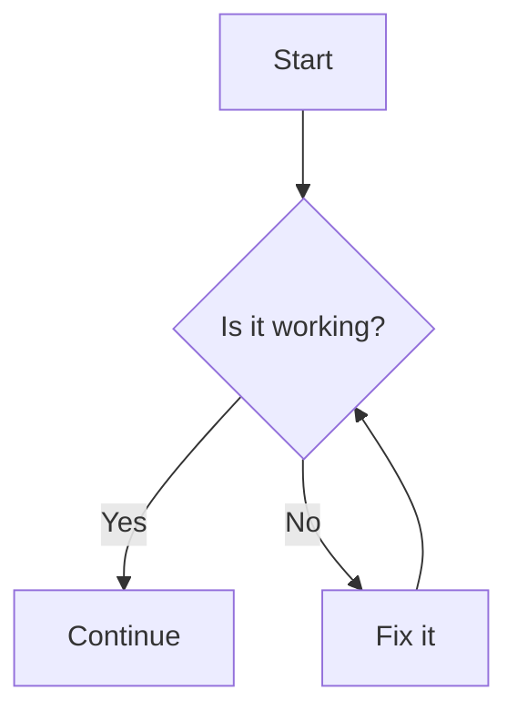

# Introduction to Slidev {style="text-shadow: 0px 0px 4px black"}

<div />

<div op-80 style="text-shadow: 0px 0px 8px black">
Presentation slides for developers
</div>

<div abs-br m-6 text-xl>
  <a href="https://github.com/slidevjs/slidev" target="_blank" class="slidev-icon-btn !border-none">
    <carbon:logo-github />
  </a>
</div>

<!-- to preload the modules -->
<Demo hidden />

---
transition: fade-out
layout: intro
class: mx-10
---

# \_Kerman {.font-mono.text-primary}

<div class="leading-8 opacity-80">
Slidev 团队成员 <br>
USTC 本科 2023级
</div>

<div my-16 w-min grid="~ cols-[40px_1fr] gap-y4" items-center justify-center ml--3>
  <div i-ri-github-line op50 ma text-xl/>
  <div><a href="https://github.com/KermanX" target="_blank">github.com/KermanX</a></div>
  <div i-ri-twitter-x-line op50 ma text-xl/>
  <div><a href="https://x.com/KermanX_" target="_blank">x.com/KermanX_</a></div>
  <div i-ri-bluesky-line op50 ma text-xl/>
  <div><a href="https://bsky.app/profile/kermanx.github.io" target="_blank">bsky.app/profile/KermanX.github.io</a></div>
</div>


<div flex="~ gap2">

</div>

---
transition: fade-out
layout: section
---

<div text-5xl pb-2>

Yet Another 

</div>

# Slides Maker?

---
layout: none
zoom: 0.8
preload: false
---

<Demo />

---
transition: slide-left
---

# Math?

Supports $\KaTeX$, a subset of $\LaTeX$.

$$ {1|2|3|4|all}
\begin{aligned}
\nabla \cdot \vec{E} &= \frac{\rho}{\varepsilon_0} \\
\nabla \cdot \vec{B} &= 0 \\
\nabla \times \vec{E} &= -\frac{\partial\vec{B}}{\partial t} \\
\nabla \times \vec{B} &= \mu_0\vec{J} + \mu_0\varepsilon_0\frac{\partial\vec{E}}{\partial t}
\end{aligned}
$$

---
transition: slide-left
---

# Graph?

Mermaid.js / PlantUML / Custom renderer

<div grid grid-cols-2 gap-12>
<div>

````md
  ```mermaid
  graph TB
    A[Start] --> B{Is it working?}
    B -- Yes --> C[Continue]
    B -- No --> D[Fix it]
    D --> B
  ```
````

</div>



</div>

---
clicks: 2
transition: slide-left
---

# Code? <span v-click="2"> Even editable! </span>

<span v-if="$clicks < 1">It couldn't be simpler!</span>
<span v-else-if="$clicks < 2">"Shiki Magic Move"!</span>
<span v-else>"Monaco Editor"!</span>

<div v-show="$clicks < 2">

````md magic-move
```cpp
#include <stdio.h>

int main() {
  printf("Hello, Slidev!\n");

  for (int i = 0; i < 10; i++) {
    printf("%d\n", i);
  }
}
```

```cpp
#include <iostream>

int main() {
  std::cout << "Hello, Slidev!" << std::endl;

  for (int i : std::views::iota(0, 10)) {
    std::cout << i << std::endl;
  }
}
```
````

</div>

<div v-show="$clicks >= 2">

```ts {monaco}{height: 'auto'}
import { ref, watchEffect } from 'vue'

const a = ref(1)

watchEffect(() => {
  console.log(a.value)
})
```

</div>

---
transition: slide-left
---

# Interactivity?

<Connections class="mt-4"/>

<!-- <iframe v-click fixed right-0 w-120 h-68 top-30  src="https://sli.dev" ></iframe> -->

<iframe fixed right-10 w-120 h-68 top-30 bottom-0  src="https://www.youtube.com/embed/dQw4w9WgXcQ?si=hCnWGH-S8ML-hjau" title="YouTube video player" frameborder="0" allow="accelerometer; autoplay; clipboard-write; encrypted-media; gyroscope; picture-in-picture; web-share" referrerpolicy="strict-origin-when-cross-origin" allowfullscreen></iframe>

---
transition: fade-out
---

# Animation & 3D?

<div class="w-60 relative">
  <div class="relative w-40 h-40">
    
    
    
  </div>

  <div
    class="text-5xl absolute top-14 left-40 text-[#2B90B6] -z-1"
    v-motion
    :initial="{ x: -80, opacity: 0}"
    :enter="{ x: 0, opacity: 1, transition: { delay: 2000, duration: 1000 } }">
    Slidev
  </div>
</div>


<div v-drag="[474,126,489,410]" v-motion :initial="{opacity: 0}" :enter="{ opacity: 1, transition: { delay: 3000, duration: 2000 } }">
<TresCanvas v-bind="state">
  <Scene />
</TresCanvas>
<div op-80 abs-br>
by <span italic>Alvaro Saburido</span>
</div>
</div>


<!-- vue script setup scripts can be directly used in markdown, and will only affects current page -->
<script setup lang="ts">
const final = {
  x: 0,
  y: 0,
  rotate: 0,
  scale: 1,
  transition: {
    type: 'spring',
    damping: 10,
    stiffness: 20,
    mass: 2
  }
}

import { TresCanvas } from '@tresjs/core';
import { onMounted, reactive, ref } from 'vue';
import { BasicShadowMap, NoToneMapping, SRGBColorSpace } from 'three';
import Scene from './components/Scene.vue';

const state = reactive({
	alpha: true,
	transparent: true,
	shadowMapType: BasicShadowMap,
	outputColorSpace: SRGBColorSpace,
	toneMapping: NoToneMapping,
});
</script>

---
transition: fade-out
---

# Open Source & Free!

<div />

#### 假设：

- 学生 (USTC)
- 没有/几乎没有 JavaScript / HTML / CSS 经验

<div h-2 />

#### 目标：

- 对于学术报告，提高制作效率：
    - 学术幻灯片只需要排版和代码展示，基于文本的方式最为高效
    - 专注于文本内容，自带优雅的样式
- 对于演讲，使你的幻灯片更吸引人
    - 制作可交互的幻灯片
    - Slidev is Hackable，只有想象力是限制


---
layout: section
transition: fade-out
---

<h1>
<span class="text-white!"> Your First </span>
<span class="slidev"> Slidev </span>
</h1>

<style>
.slidev {
  background-color: #2B90B6;
  background-image: linear-gradient(45deg, #4EC5D4 10%, #146b8c 80%);
  background-size: 100%;
  -webkit-background-clip: text;
  -moz-background-clip: text;
  -webkit-text-fill-color: transparent;
  -moz-text-fill-color: transparent;
}
</style>

---

<div op-80> Option 1: </div>

# Stackblitz 在线环境

<div />

<div font-bold text-2xl class="font-[Consolas]" border="b dashed" w-min> https://sli.dev/new </div>

<div float-right mt--20>

优点：无需任何配置，只需要浏览器

缺点：编辑体验不如本地环境

</div>


---

<div op-80> Option 2: </div>

# 本地环境

<div />

1. 安装 Node.js

    - 打开 <span class="font-[Consolas] text-blue border-b ml-1 border-blue"> https://nodejs.org/ </span>
    - 点击下载按钮并安装

2. 换源 (可选)

    打开终端，运行以下命令

```bash
  npm config set registry https://registry.npmmirror.com
```

---

<div op-80> 本地环境 </div>

# 创建 Slidev 项目

- 打开终端 [（桌面/文件夹中右键，选择“在终端中打开”）]{.op-80.text-sm}

- 创建 Slidev 项目

```bash
  npm create slidev@latest
```

- 进入项目目录

```bash
  cd my-slidev
```

- 打开 VSCode

```bash
  code .
```

---

<div op-80> 本地环境 </div>

# 运行 Slidev

<div />

打开终端（推荐使用 VSCode 内置终端），执行以下命令：

```bash
npm run dev
```

会自动打开一个浏览器窗口，显示你的幻灯片

尝试编辑 `slides.md` 文件，保存后浏览器会自动更新内容

---

<div op-80> 本地环境 </div>

# VSCode 拓展

<div />

搜索 “Slidev”，安装拓展

<v-clicks at="1">

- [点击 Slidev 图标]{.text-red}
- [幻灯片导航]{.text-yellow}
- [幻灯片预览]{.text-green}

</v-clicks>


<div v-click border="2 red rounded" v-drag="[510,283,44,43]" />

<div v-click border="2 yellow rounded" v-drag="[555,46,216,276]" />

<div v-click border="2 green rounded" v-drag="[555,323,216,214]" />

---

# 用户界面

<div />

<div grid grid-cols-2 gap-12>
<div>

#### 导航栏 {.mb-2}

- <carbon-maximize /> 全屏播放
- <carbon-arrow-left /><carbon-arrow-right /> 上一步/下一步
- <carbon-apps /> 幻灯片列表
- <carbon-user-avatar /> 打开摄像头
- <carbon-video /> 录制演讲
- <carbon-pen /> 绘图
- <carbon-text-annotation-toggle /> 编辑幻灯片


</div>
<div>

#### 快捷键 {.mb-2}

- <carbon-arrow-left /><carbon-arrow-right /><span class="acc-key"> SPACE </span> 上一步/下一步
- <carbon-arrow-up /><carbon-arrow-down /> 上一张/下一张 <span ml-1 op-80>(跳过动画)</span>
- <span class="acc-key"> F </span> 全屏

</div>
</div>

<svg v-drag="[317,275,128,239,12]" op-60 width="275" height="463" viewBox="0 0 275 463" fill="none" xmlns="http://www.w3.org/2000/svg">
<path d="M134.511 461.181C134.611 462.004 135.359 462.589 136.181 462.489L149.582 460.858C150.405 460.758 150.99 460.01 150.89 459.187C150.79 458.365 150.042 457.78 149.22 457.88L137.308 459.33L135.858 447.418C135.758 446.595 135.01 446.01 134.187 446.11C133.365 446.21 132.78 446.958 132.88 447.78L134.511 461.181ZM1.17697 6.48952C51.5194 0.508233 102.808 3.25775 146.963 16.3754C191.121 29.4936 228.037 52.9439 249.849 88.2878C271.644 123.605 278.503 171.033 262.098 232.425C245.685 293.845 206.001 369.162 134.819 460.075L137.181 461.925C208.499 370.838 248.44 295.155 264.996 233.2C281.559 171.217 274.731 122.895 252.401 86.7122C230.088 50.556 192.442 26.7564 147.818 13.4996C103.192 0.24223 51.4806 -2.50825 0.823027 3.51048L1.17697 6.48952Z" fill="white" stroke-dasharray="4 4" />
</svg>

<div border="t-2 r-2 dashed white op-60" fixed left-0 bottom-0 w-90 h-10 />

<style>
.slidev-icon {
  @apply ml-2 border border-#777 border-rounded border-op-50 p-1 text-2xl mb--1;
}
.acc-key {
  @apply mx-2 border border-#777 border-rounded border-op-50 p-1 text-4 leading-5 mb--1 min-w-7 inline-block text-center;
}
</style>

---
layout: section
---

# 语法介绍

---

# Markdown

<div />

<div grid grid-cols-2 gap-12>
<div>

幻灯片的内容使用 Markdown 语法编写

```md
# 标题

- 列表项 1
- 列表项 2

**粗体** *斜体* ~~删除线~~

[链接](https://sli.dev)
```

</div>
<div mt-14>

# 标题

- 列表项 1
- 列表项 2

**粗体** *斜体* ~~删除线~~

[链接](https://sli.dev){.text-blue}

</div>
</div>

<style>
li {
  @apply !leading-8;
}
</style>

---
clicks: 3
---

# HTML & Vue

<div />

HTML 和 Vue 提供更强大的灵活性

<div grid grid-cols-2 gap-12>
<div>

```md
<div style="color: red">
  Some HTML
</div>
<div v-for="i in 3">{{ 2**i }}</div>
```

</div>
<div mt-1>

<div style="color: red">
  Some HTML
</div>

<div v-for="i in 3">{{ 2**i }}</div>

</div>
</div>

<div v-click grid grid-cols-4 gap-4 mt-16>
<div border="2 #74c7ec rounded-xl" bg="#74c7ec op-20" py-2 px-4 min-h-26 max-h-max>
Markdown <span text-xs op-90>(Standard)</span>
<div border="2 #e0744c rounded-xl" bg="#e0744c op-20" py-2 px-4 mt-1>
HTML
</div>
</div>
<div border="2 #42d392 rounded-xl" bg="#42d392 op-20" py-2 px-4 min-h-26 max-h-max>
Vue
<div border="2 #e0744c rounded-xl" bg="#e0744c op-20" py-2 px-4 mt-1>
HTML
</div>
</div>
<div col-span-2 flex gap-4 v-click="2">
<carbon-arrow-right text-3xl mt-8/>
<div flex-grow border="2 #2a90b5 rounded-xl" bg="#2a90b5 op-20" py-2 px-4 transition-all duration-500 h-26 :class="$clicks > 2 ? 'h-42' : ''">
Slidev Syntax
<div flex children:flex-grow gap-4 children:text-center>
<div border="2 #74c7ec rounded-xl" bg="#74c7ec op-20" py-2 px-4 mt-1>
Markdown
</div>
<div border="2 #42d392 rounded-xl" bg="#42d392 op-20" py-2 px-4 mt-1>
Vue
</div>
<div border="2 #e0744c rounded-xl" bg="#e0744c op-20" py-2 px-4 mt-1>
HTML
</div>
</div>
<div border="2 #aaaaaa rounded-xl" bg="#aaaaaa op-20" py-2 px-4 mt-4 mb-2 transition forward:delay-200 op-0 :class="$clicks > 2 ? 'op-100' : ''">
Custom Syntax
</div>
</div>
</div>
</div>

---

# UnoCSS

<div />

CSS 和 UnoCSS 提供更多的样式选择

需要一些学习。可能比 LaTeX 更简单和直观

<div grid grid-cols-2 gap-12>
<div flex flex-col gap-4>

```md
<div text-blue> Text color </div>

<div text-2xl> Text size </div>

<div border="1 blue"> Border </div>

<div bg="blue op-40"> Background </div>

<div pl-8> Padding </div>
```

</div>

<div mt-1 flex flex-col gap-6>
<div text-blue> Text color </div>

<div text-2xl mt--1> Text size </div>

<div border="1 blue"> Border </div>

<div bg="blue op-40"> Background </div>

<div pl-8> Padding </div>

</div>
</div>

---

# 声明式 CSS

当然，我们也可以使用普通的 CSS

- 全局 CSS: `./style.css`
- 每个幻灯片的专属 CSS: `style` 标签：

```vue
# My slide

<style>
h1 {
  color: red;
  // Or: @apply text-red;
}
</style>

---

# This won't be red
```

---

# 常用布局

基于 Web 的幻灯片有更多的布局选择

<div mt--4 />

- Grid：静态分配空间

<div grid grid-cols-2 gap-12>

```md
<div grid grid-cols-2 gap-4>
  <div border p-2> Left  </div>
  <div border p-2> Right </div>
</div>
```

<div grid grid-cols-2 gap-4 p-2 :className="className">
<div border p-2> Left  </div>
<div border p-2> Right </div>
</div>
</div>

- Flex：动态分配空间

<div grid grid-cols-2 gap-12>

<div w-100>

```md
<div flex gap-4>
  <div border p-2> Item  </div>
  <div border p-2> Large Item </div>
  <div border p-2 flex-grow> Rest </div>
</div>
```

</div>

<div flex gap-4 p-2 :className="className">
<div border p-2> Item  </div>
<div border p-2> Large Item </div>
<div border p-2 flex-grow> Rest </div>
</div>
</div>

<div v-click mt-2 text-xl flex items-bottom>
<simple-icons-mdnwebdocs text-blue mr-3 /><span>MDN Web Docs</span>
<a href="https://developer.mozilla.org/zh-CN/" class="font-[Consolas] ml-6 text-lg block mt-0.5 align-bottom"> https://developer.mozilla.org/zh-CN/ </a>
</div>

<!-- <div grid grid-cols-3>
<label><input type="checkbox" v-model="item1" :disabled="item1" /><code> items-start </code></label>
<label><input type="checkbox" v-model="item2" :disabled="item2" /><code> items-center </code></label>
<label><input type="checkbox" v-model="item3" :disabled="item3" /><code> items-end </code></label>
<label><input type="checkbox" v-model="justify1" :disabled="justify1" /><code> justify-start </code></label>
<label><input type="checkbox" v-model="justify2" :disabled="justify2" /><code> justify-center </code></label>
<label><input type="checkbox" v-model="justify3" :disabled="justify3" /><code> justify-end </code></label>
</div> -->

<script setup>
import { ref, computed } from 'vue'
const items = ref(0)
const justify = ref(0)
const item1 = computed({ get: () => items.value == 0, set: () => items.value = 0 })
const item2 = computed({ get: () => items.value == 1, set: () => items.value = 1 })
const item3 = computed({ get: () => items.value == 2, set: () => items.value = 2 })
const justify1 = computed({ get: () => justify.value == 0, set: () => justify.value = 0 })
const justify2 = computed({ get: () => justify.value == 1, set: () => justify.value = 1 })
const justify3 = computed({ get: () => justify.value == 2, set: () => justify.value = 2 })
const className = computed(() => {
  return [
    'items-start',
    'items-center',
    'items-end',
  ][items.value] + ' ' + [
    'justify-start',
    'justify-center',
    'justify-end',
  ][justify.value]
})
</script>

---

# 分隔幻灯片

以上是单张幻灯片的编写方式，如何编写多张幻灯片？

```md
# 第一页

第一页的内容

---

# 第二页

第二页的内容
```

<div mt-8 op-80>

注：VSCode 拓展会使用蓝色线条突出分隔符

</div>

---

# 配置幻灯片

为幻灯片添加属性！

```md
---
theme: seriph
---

# 第一张幻灯片

---
layout: intro
---

# 第二页的布局是 intro！

---

# 第三页没有任何配置
```

<div v-click rounded-xl border="2 yellow" v-drag="[61,141,221,80]" />

<div v-after text-yellow v-drag="[302,132,363,NaN]">

第一页前的配置是 `Headmatter`

用于配置整个文稿的属性

</div>

<div v-click rounded-xl border="2 green" v-drag="[58,285,221,80]" />

<div v-after text-green v-drag="[300,277,363,NaN]">

其他每页前的配置是 `Frontmatter`

用于配置单页的属性

</div>

<div v-click rounded-xl border="2 red" v-drag="[60,423,223,44]" />

<div v-after text-red v-drag="[297,415,363,NaN]">

`Headmatter` 和 `Frontmatter` 都是可选的

</div>

---

# 数学公式

<div />

<div grid grid-cols-2 gap-12>
<div>

```md
  **行内公式**：$1 + 1 = \textcircled{9}$


  **多行公式**：
  $$ {all|1|2}
  \begin{aligned}
  a x^2 + b x + c &= 0 \\
  x &= \frac{-b \pm \sqrt{b^2 - 4ac}}
            {2a}
  \end{aligned}
  $$
```

</div>
<div>


**行内公式**：$1 + 1 = \textcircled{9}$

<div h-2 />

**多行公式**：
$$ {all|1|2}
\begin{aligned}
a x^2 + b x + c &= 0 \\
x &= \frac{-b \pm \sqrt{b^2 - 4ac}}{2a}
\end{aligned}
$$

</div>
</div>


---

# 代码块

<div />

朴实无华的代码块，语法和 Markdown 相同

<div grid grid-cols-2 gap-12>

````md
  ```js
  console.log('Hello, Slidev!')
  ```
````

```js
console.log('Hello, Slidev!')
```

</div>

<div>

带有动态突出显示的代码块

<div grid grid-cols-2 gap-12>

````md
  ```js {1-2|3|4}
  const a = 2;
  const b = 3;
  const c = a ** b;
  console.log(c);
  ```
````

```js {1-2|3|4}
const a = 2;
const b = 3;
const c = a ** b;
console.log(c);
```

</div>
</div>

---
class: code-sm
---

<!-- # 代码编辑器

<div grid grid-cols-2 gap-4 mb-4>

````md
  ```js {monaco}
  console.log('Hello, Slidev!')
  ```
````

```js {monaco}
console.log('Hello, Slidev!')
```

</div> -->


# 代码运行器 <span text-lg text-white op-80> 内置 JavaScript & TypeScript, Python 可安装插件 </span>

<div grid grid-cols-2 gap-4>

````md
  ---
  addons:
    - python-runner
  ---

  <!-- ... -->

  ```py {monaco-run}
  import pandas as pd
  from termcolor import colored

  print(colored("Slidev", "blue"))
  df = pd.DataFrame({
    'a': [1, 2],
    'b': [3, 4]
  })
  print(df)
  ```
````

```python {monaco-run}
import pandas as pd
from termcolor import colored

print(colored("Slidev", "blue"))
df = pd.DataFrame({
  'a': [1, 2],
  'b': [3, 4]
})
print(df)
```

</div>

---

# 点击动画

我也不知道为什么叫 “点击动画”，其实就是一步一步的动画意思

<div grid grid-cols-2 gap-12 mb-6>

```md
<div> 1 + 1 = ? </div>
<div v-click> ⑨ ? </div>
<div v-click> No! </div>
<div v-after> It's 2. </div>
```

<div>

<div> 1 + 1 = ? </div>
<div v-click> ⑨ ? </div>
<div v-click> No! </div>
<div v-after> It's 2. </div>

</div>
</div>

<div v-click>

- `v-click`: 下一步才显示
- `v-after`: 和上一个 `v-click` 或 `v-after` 同时显示

</div>

---

# 列表动画

对于列表和表格，写一堆 `v-click` 也太麻烦了

<div grid grid-cols-2 gap-12 mt--2>

```md
<v-clicks>

- Option 1
- Option 2
- Option 3

</v-clicks>

<v-clicks>

| ID | Data |
| -- | ---- |
| 1  | A    |
| 2  | B    |

</v-clicks>
```

<div>

<v-clicks>

- Option 1
- Option 2
- Option 3

</v-clicks>

<div h-26 />

<v-clicks>

| ID | Data |
| -- | ---- |
| 1  | A    |
| 2  | B    |

</v-clicks>

</div>
</div>

---
clicks: 3
---

# 不按顺序的动画

这也是一种常见的情况

<div grid grid-cols-2 mt--2>

```md
<div v-click="2"> Third  </div>
<div v-click="0"> First  </div>
<div v-click="1"> Second </div>
```

<div pt-2 pl-12>

<div v-click="2"> Third  </div>
<div v-click="0"> First  </div>
<div v-click="1"> Second </div>

</div>
</div>

<div h-8 />

# 编程式的动画

<div grid grid-cols-2 mt--2>

```vue
<div :class="{'text-red': $clicks > 2}">
  will change color
</div>
```

<div pt-2 pl-12>

<div :class="{'text-red': $clicks > 2}">
  will change color
</div>

</div>
</div>

在 frontmatter 使用 `clicks: 3` 来控制动画步骤总数

---
transition: view-transition
---

# 其他很强大的动画类型

<div />

- Slide transition

- <span view-transition-title> CSS view transition </span>

- CSS transition property

- Motion

---
transition: view-transition
---

# <span view-transition-title> View Transition </span>

很酷，对吧

```md
---
transition: view-transition
---

# 其他很强大的动画类型

- <span view-transition-title> CSS view transition </span>

---
transition: view-transition
---

# <span view-transition-title> View Transition </span>
```

---

# Icons

<div />

<div grid grid-cols-2 gap-12>

```md
<carbon-logo-github />
<i i-carbon-chart-column />
```

<div flex flex-col gap-2 mt-2 text-xl>
<carbon-logo-github />
<i i-carbon-chart-column />
</div>
</div>

<div class="font-[Consolas]" mt-4> <a href="https://icones.js.org/">https://icones.js.org/</a> </div>

<iframe src="https://icones.js.org/" h-163 mt-2 class="origin-left-top w-200% scale-50" />

---
dragPos:
  square: 677,37,167,_,-16
---

# Draggable Elements

Double-click on the draggable elements to edit their positions.

<br>

###### Directive Usage

```md

```

<br>

###### Component Usage

```md
<v-drag text-3xl>
  <div class="i-carbon:arrow-up" />
  Use the `v-drag` component to have a draggable container!
</v-drag>
```

<v-drag pos="663,206,261,_,-15">
  <div text-center text-3xl border border-main rounded>
    Double-click me!
  </div>
</v-drag>


###### Draggable Arrow

```md
<v-drag-arrow two-way />
```

<v-drag-arrow pos="630,426,253,46" two-way op70 />

---
layout: section
---

# 一些技巧

---

# 演示

- Option 1: **投屏 / HDMI**
    - 我的首选

- Option 2: **局域网**
    - 你的电脑启动 `npm run dev --remote`，目标设备访问该地址
    - 不同设备，演讲者可以看演讲者视图，进度和绘图同步
    - 科大好像不支持

- Option 3: **导出到 PPTX / PDF**
    - 丧失交互性
    - 不得已的选择

- Option 4: **部署到 GitHub Pages 等**
    - 任何时候都可以访问
    - 无法同步进度和绘图

<style>
li p {
  @apply mb-0 mt-0;
}
li {
  @apply !leading-8.5;
}
</style>

---

# 导出

<div relative v-mark.cross.red>

```bash
npm run export --format pdf
npm run export --format pptx
npm run export --format png
```

会有提示要求你安装 Playwright，可能面临网络问题

PPTX 是一堆图片

导出有很多有用的选项，参见我们的文档

<div v-click="1" absolute inset-0 bg="#121212 op-80" />
</div>

<div v-after text-2xl text-center mt-16>

即将推出更易用、更稳定的导出方式，敬请期待！

[(前几天才想到思路，来不及写完了😇)]{.op-90.text-lg}

</div>

---

# 部署

<div />

编译成静态网站：

```bash
npm run build
npm run build --base /folder/
```

（生成的代码在 `dist` 目录下）

<div h-4 />

或者，使用托管服务，解放双手：

- GitHub Pages / Netlify / Vercel

- Slidev 官网有指南，非常方便

---

# AI

<div />

<div grid grid-cols-2 gap-4 mb-12>
<div>

- Bolt.new (有专门的 Slidev 选项)

<video src="./assets/boltnew.mp4" autoplay loop muted w-100 mt-4 float-right />

</div>
<div>

- GitHub Copilot / Cursor / ...

{.w-100.text-right.mt-4}

</div>
</div>

---

# 网络问题

<div />

- 代理
- 换源
- PNPM
- GitHub Codespaces

---

# 一些提示

<div />

- PPT 和 Slidev 的适用场景不同，有的时候 PPT 更合适
- 使用 Slidev 时，先确定是追求效率还是质量
    - 追求效率：Slidev 里只需要写文本，就可以获得不错的排版
        - 写好了文章，需要做汇报的情况
    - 追求质量：编写 CSS 和 Vue，可以做出完美效果，但需要更多时间
        - 专业演讲，需要更好的效果
- Slidev 中的高级功能需要一些 JavaScript / CSS 知识，如果没有基础，琢磨起来比较耗时
  
  可以在社区里（群里）提问

---

# 更多功能，参见文档 <span ml-6 text-white class="font-[Consolas]"> https://cn.sli.dev </span>

<div h-4 />

<iframe src="https://cn.sli.dev/features/" class="origin-left-top w-150% scale-67"  h-160 />

---

# 加入我们的社区

欢迎提 issue 和问题，也欢迎 PR

- <carbon-earth-europe-africa-filled /> Website: https://sli.dev <div h-2/>
- <carbon-logo-github /> GitHub: https://github.com/slidevjs/slidev <div h-2/>
- <carbon-logo-discord /> Discord: https://chat.sli.dev <div h-2/>
- <cib-tencent-qq /> QQ Group: <span font-mono text-blue2>978643067</span>


<style>
a {
  @apply font-[Consolas] text-blue2;
}

li {
  @apply leading-10 text-xl;
}
</style>

---
layout: section
---

## 题外话

# TypeScript 开源社区

---

# 什么是开源

<div />

<v-clicks>

- 字面意思：开放源代码

- 做慈善？/ 另一种商业模式？/ 玩？

- <span text-2xl> **开源是一种礼物<div h-2/>互惠不是目的** </span>

</v-clicks>

<div v-after>

<div v-drag="[478,201,480,311]">
<div text-blue>
https://talks.antfu.me/2024/vueconf-shenzhen/3
</div>
<h2>Yak Shaving <span op50 font-serif italic mb--1 text-26px> by Anthony Fu </span></h2>

</div>
</div>

---

# 开源世界里不同的社区

<div />

- Linux 为代表的社区和 TypeScript 社区
    - 有相似之处
    - 成员上几乎没有交集
    - 有很多不同

- TypeScript / JavaScript 的特性
    - 脚本语言，更加难闭源
    - 大多数代码用于编写 UI，没必要隐藏代码
    - Web 世界开放共享的文化
    - “顺手就开源了” / “开源了没坏处” （当然，公开代码 ≠ 维护项目）

---

# 我参与开源的一年

<div />

- 第一次使用 Slidev 是在初中，那时 Slidev 刚发布不久，非常火爆

- 今年二月提交了第一个 PR，随后加入了 Slidev 团队

- 修复 bug、添加功能、重构代码、回答社区里的问题

- 甚至修复了一个我初中就碰到的 bug（很有趣的经历）

- 为 Slidev 编写 VSCode 拓展时，想到去开发 reactive-vscode 这个库

- 以此为契机，结识了很多朋友，包括 Slidev 的作者 Anthony Fu

- 参加了 VueConf 2024，Rolldown 团队成员告诉我 “Rust 不难”

- 于是第三次入门 Rust，终于入门成功

---

# 一些信息

<div />

1. 开源是一种礼物。不要功利地看待，但坚信它对你的价值

2. 如果你想参与开源，JavaScript / TypeScript 社区是一个很好的起点

    - 门槛不高
    - 社区活跃
    - 华人参与度不错

3. 参与开源可能需要一个契机。从你的需求出发，找到一个感兴趣的项目

---

# 其他感想

<div />

1. GitHub 上的星星数只能作相对比较，不能作绝对比较

2. 那面绿墙只能说明这位用户是否还在使用 GitHub

3. 使用英文和 minimal reproduction

---
layout: end
---

谢谢大家！
